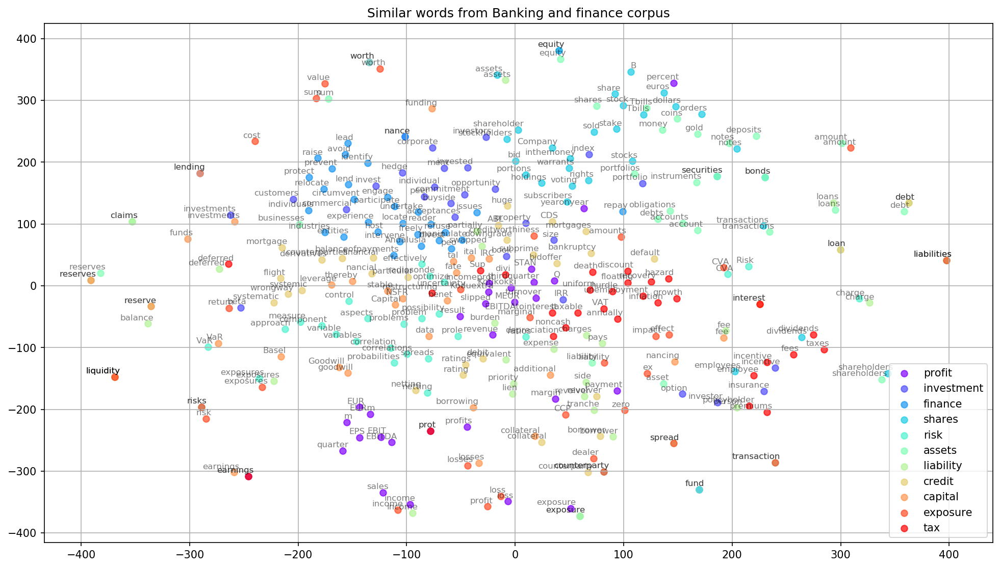
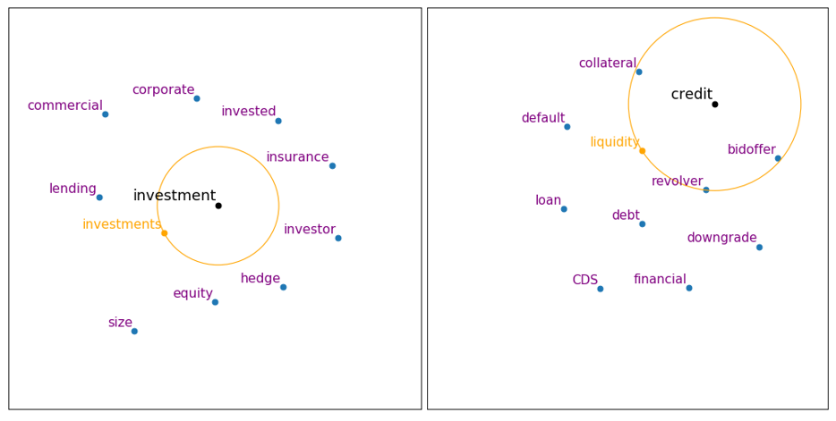
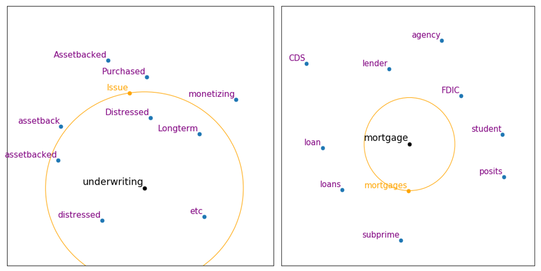
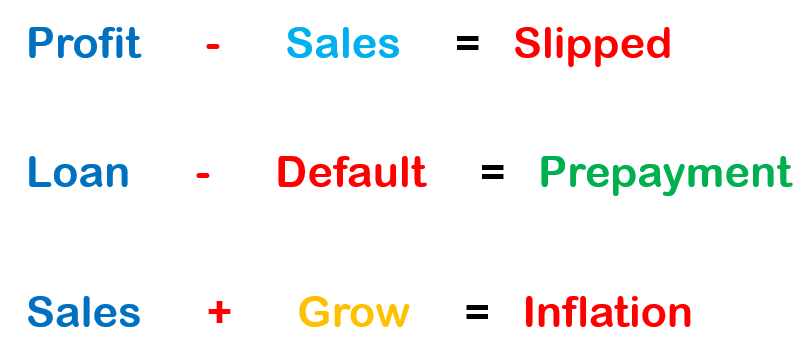

# BankFin Embeddings : Customized word embeddings Pre-Trained on Financial Text corpus for Financial NLP tasks

This repository consists of customized word embedding pre-trained on banking and finance terms which will be helpful in analyzing and classifying financial sentiments or stock price sentiment analysis.
Bank Fin Word embedding contains 100 dimensions of each financial word. It is pre-trained on 5 comprehensive books on banking and finance and financial phrase bank version 1. In this repository we have 
demonstrated the efficacy of word embeddings by different types of visualization techniques. This word embedding can be used for any financial NLP task such as Financial senstiemnt analysis or stock 
price news sentiment analysis for building robust stock price analyzer.

## Data
Bank Fin embeddings is trained on Financial Phrase Bank from [Malo et al](https://www.researchgate.net/publication/251231107_Good_Debt_or_Bad_Debt_Detecting_Semantic_Orientations_in_Economic_Texts) and following 5 comprehensive banking and finance books
1. [Basics of Finance by university of Budapest](http://unipub.lib.uni-corvinus.hu/3842/1/pfi-briefings.pdf)
2. [The Essays of Warren Buffett: Lessons for Corporate America](http://csinvesting.org/wp-content/uploads/2015/05/Essays-of-Warren-Buffett-_-Lessons-for-Corporate-America_Cunningham.pdf)
3. [Investment Banking](https://books.google.co.in/books?id=j2JSCAAAQBAJ&printsec=frontcover&dq=investment+banking+fourth+edition&hl=en&sa=X&ved=2ahUKEwiurpPf3c3qAhVRxzgGHdERAUsQ6AEwA3oECAEQAg#v=onepage&q&f=false)
4. [Money, Banking and International Finance](https://books.google.co.in/books/about/Money_Banking_and_International_Finance.html?id=eM4qnwEACAAJ&source=kp_book_description&redir_esc=y)
5. [Risk Management and financial Institutions](https://books.google.co.in/books?id=ljikBgAAQBAJ&printsec=frontcover&dq=risk+management+and+financial+institutions&hl=en&sa=X&ved=2ahUKEwin8JXx3c3qAhXoILcAHWy9CRIQ6AEwAHoECAMQAg#v=onepage&q=risk%20management%20and%20financial%20institutions&f=false)

## Word Vector Visualization
In the following image we have visualized 11 financial words with their dimensions in 2d scatterplot.

## Language Structure
Below image showed words in close proximity to specific finance words

## Word Algebra

The core idea is that once words are represented as numerical vectors, you can do math with them. The mathematical procedure goes like this:

- Provide a set of words or phrases that you'd like to add or subtract.
- Look up the vectors that represent those terms in the word vector model.
- Add and subtract those vectors to produce a new, combined vector.
- Look up the most similar vector(s) to this new, combined vector via cosine similarity.
- Return the word(s) associated with the similar vector(s).

This is the amazing property of word embeddings, because it means that they carry important relational information that can be used in many different NLP tasks.

## Application

Word2Vec isn't Deep learning at all, as the model is actually very shallow. However, there is an important relation here, because word embeddings are usually used to initialize
dense LSTM embeddings for different tasks using deep architectures. Also you can of course train Bank Fin vec embedding model using techniques developed in Deep Learning context.

- It can be helpful in analyzing financial survey responses
- It can also be used to detect sentiments of financial news or text in the form of positive, negative or neutral sentiment.
- It can be helpful in financial text classification, financial document similarity, readability index and many more.

## FAQ

You can find this [tutorial](https://github.com/sid321axn/bank_fin_embedding/blob/master/Bank%20Fin%20embedding%20visualization.ipynb) on how to use BankFin embedding for a quick start.

## References
1. L. Maate and G. Hinton, "Visualizing data using t-SNE", Journal of Machine Learning Research, vol. 9, pp. 2579-2605, 2008. 
2. T. Mikolov, I. Sutskever, K. Chen, G. Corrado and J. Dean, "Distributed Representations of Words and Phrases and their Compositionality", Advances in Neural Information Processing Systems, pp. 3111-3119, 2013. 
3. R. Rehurek and P. Sojka, "Software Framework for Topic Modelling with Large Corpora", Proceedings of the LREC 2010 Workshop on New Challenges for NLP Frameworks, 2010.
4. Word Vector with small corpora : Visualizing word vectors [Link](https://chrisculy.net/lx/wordvectors/wvecs_visualization.html)
5. Visualizing word 2 vec [Link](https://github.com/sismetanin/word2vec-tsne)

## Documentation and How to report bugs
* Gensim documentatiob: [https://radimrehurek.com/gensim/](https://radimrehurek.com/gensim/). 
* Scikit-learn documentation: [http://scikit-learn.org/stable/documentation.html](http://scikit-learn.org/stable/documentation.html). 
* If you find any issues, please open a bug here on GitHub.
 
